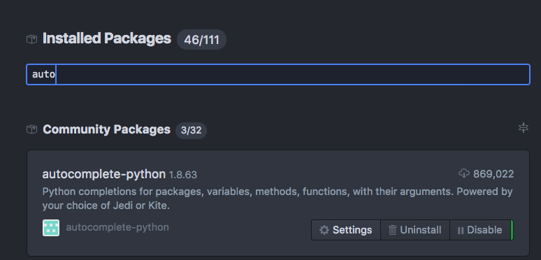
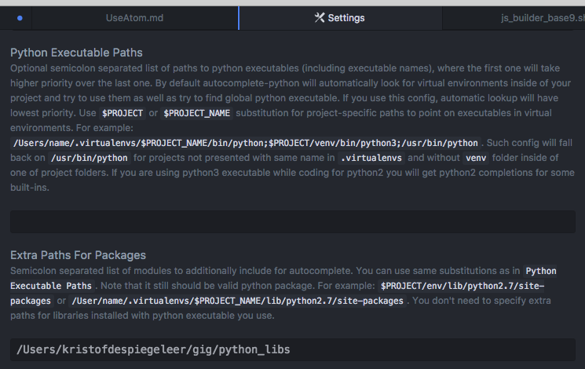
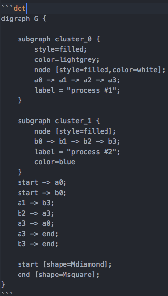
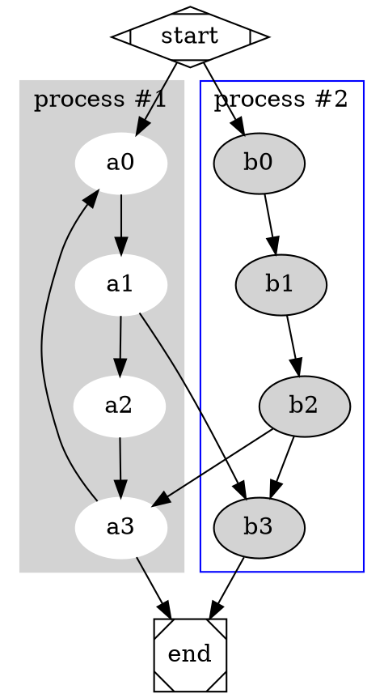

# how to use atom for js9

## requirements

- install python3 & pip
- install

```
pip3 install autopep8
pip3 install jedi
```

## install required plugins for atom

```bash
apm install linter
apm install atom-mermaid
apm install language-mermaid
apm install language-markdown
apm install language-capnproto
apm install hyperclick-markdown
apm install hyperclick
apm install diagrams
apm install autocomplete-python
apm install linter-flake8
apm install linter-raml
apm install linter-ui-default
apm install markdown-folder
apm install markdown-mindmap
apm install markdown-pdf
apm install markdown-preview-enhanced
apm install markdown-scroll-sync
apm install path-hyperclick
apm install python-autopep8
apm install raml

```

## configure atom

- go to plugins install/look for autocomplete-python
- adjust setting: Extra Paths For packages

add (ofcourse change yourusername)
```
/Users/yourusername/js9host/autocomplete
```

- ofcourse change to your own home path (check it exists).
- when installing/building js9 docker it will sync all required libs to this path so you can use the autocompletion



settings in the plugin



see how the autocompletion  works


## nice plugins

### graphiz

- http://www.graphviz.org/

install requirements (osx)

```bash
brew install graphviz
```

- good example on: http://www.graphviz.org/content/cluster



following should now show a dot example



### mermaid

- see  https://atom.io/packages/atom-mermaid
- http://knsv.github.io/mermaid/

requirements:

```bash
#make sure node is installed, for osx:
#brew install npm
sudo npm install -g mermaid
```

- if you now create a codeblock with mermaid type


you should get an output


